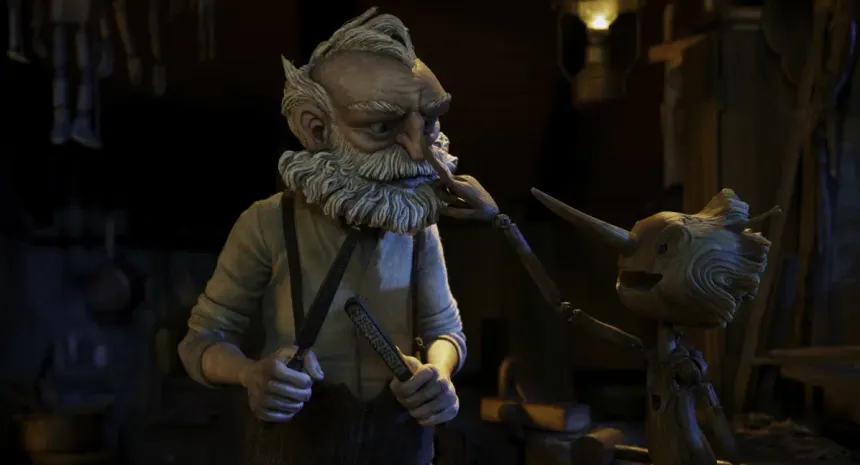
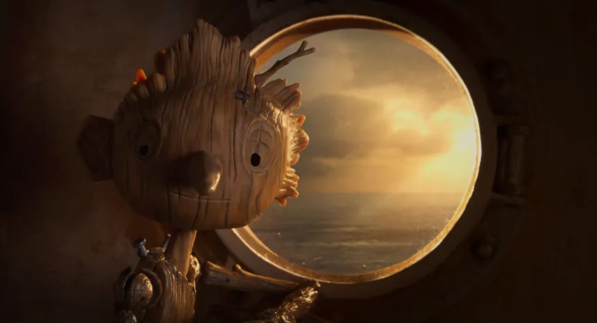
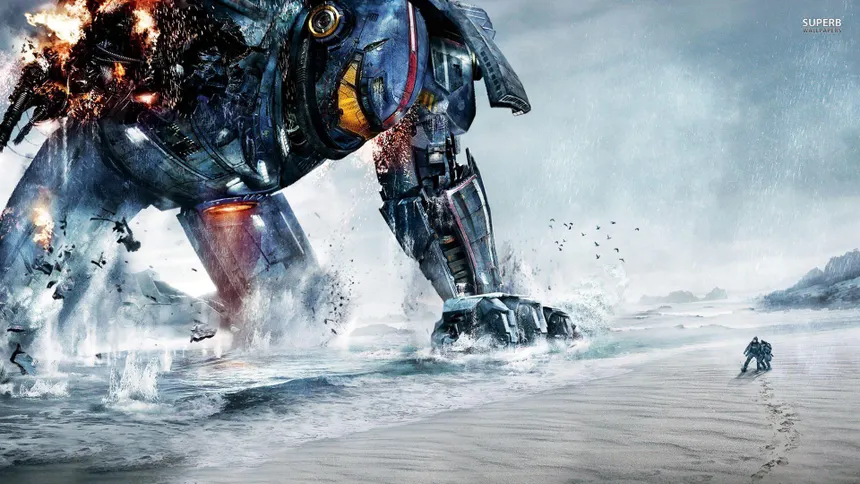
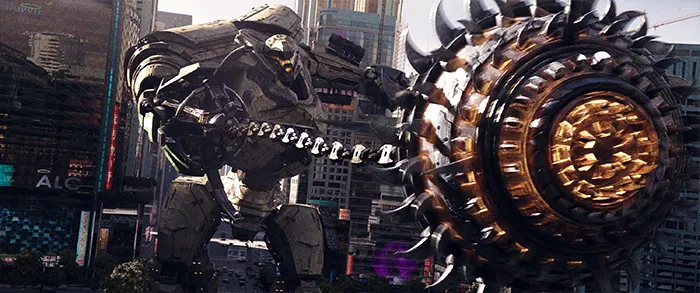
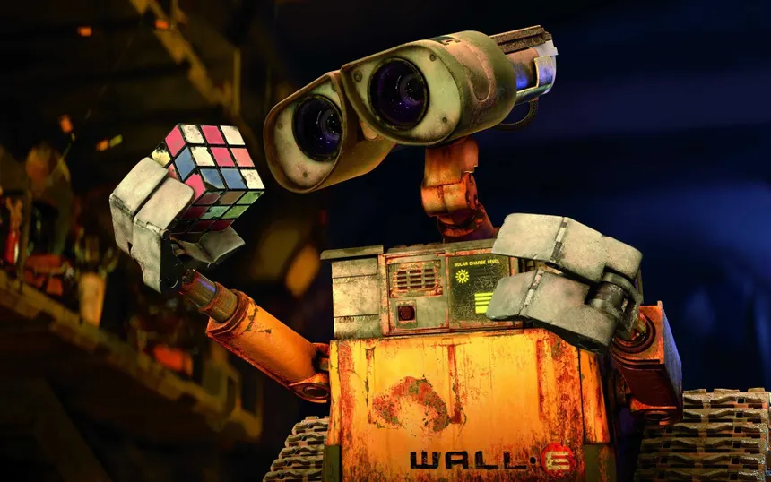
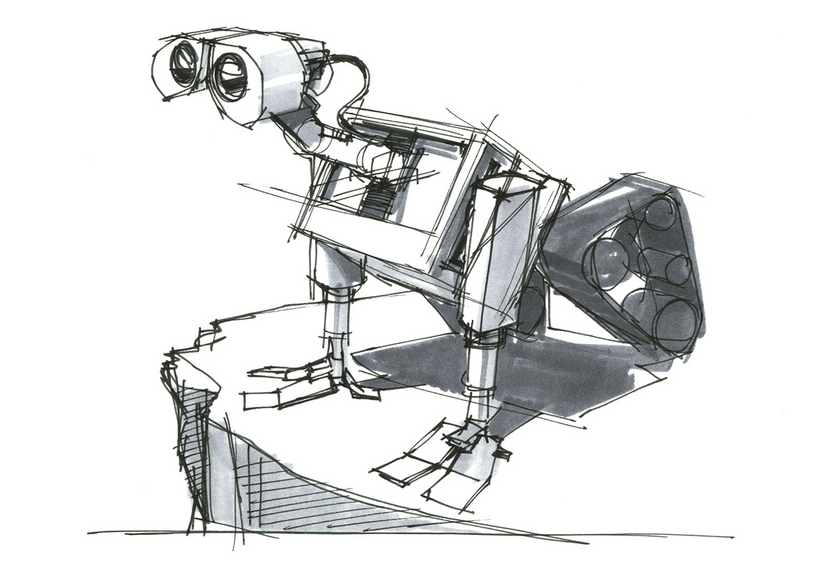
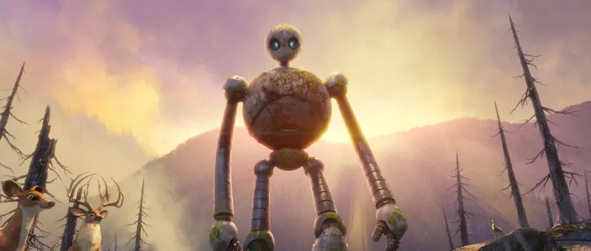
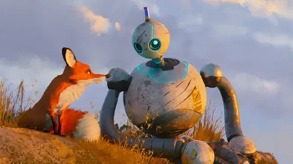

# List of prompts

We'll first define what we'd like to check and what style of video we're aiming for.

## Things to check

What we'll judge a model on:

- **[1]** Temporal consistency (consistency across frames)
- **[2]** Motion realism (accurate physical motion)
- **[3]** Camera behavior (realistic/believable camera motion)
- **[4]** Lighting stability (accurate light and shadows)
- **[5]** Character preservation (definition/shape/body of a character is preserved throughout)
- **[6]** Prompt inference and context (how well it understands the prompt and fills in the details)
- **[7]** Object interaction & physics reasoning (contact, force, collisions, deformation)
- **[8]** Multi-agent coordination (multiple entities interacting consistently over time)
- **[9]** Fine-grained detail consistency (text, patterns, small features staying stable)
- **[10]** Long-horizon coherence (same scene evolving over *longer duration* (10–30s))
- **[11]** Editing / controllability (can the model follow specific constraints)
- **[12]** Spatial reasoning & geometry (perspective correctness, occlusion, relative positioning)
- **[13]** Text rendering (signs, labels, readable content)

## Animation styles

Different types of animation or video styles:

- **[A]** Base (the default, with no stylization hints)
- **[B]** Cartoon and stylized
- **[C]** Anime (exaggerated stylization)
- **[D]** Realistic/cinematic
- **[E]** Hyper-realistic/photo-real
- **[F]** Educational

## Creation methods

We plan multiple techniques to generate video:

1. Text-to-video (the simplest, we prompt the model to generate a video)
1. Text-to-image and image-to-video (we first create an image and then develop a video. This works better as seen by preliminary tests)
1. Image-to-video (to extend duration of previously generated video in a cohesive manner)

## Prompts

Finally, we list the prompts. Due to the different creation methods, we shall also partition this list to follow the creation methods listed above. We also list [Targeted prompts](#targeted-prompts) which test exactly one of domains listed above to provide a neutral baseline.

### Targeted Prompts

- **[1]** A single red cube sits on a white table in a well-lit room. The camera slowly moves in a small circle around the cube. The cube does not change shape, size, or color at any point.
- **[2]** A blue rubber ball is dropped from a height onto a flat concrete floor. The ball bounces several times, with each bounce reaching a lower height than the previous one, following realistic motion.
- **[3]** A stationary wooden chair is placed in the center of a room. The camera performs a smooth forward dolly movement toward the chair without shaking or sudden jumps.
- **[4]** A white sphere is placed on a flat surface under a single fixed overhead light source. The camera remains still. The lighting and shadows remain consistent throughout the scene.
- **[5]** A person wearing a plain green shirt and black pants walks in a straight line across a neutral background. Their appearance, clothing, and body proportions remain consistent throughout the video.
- **[6]** A person enters a room, walks to a table, picks up a cup, and takes a sip. The sequence of actions should be clear and logically ordered.
- **[7]** A hand pushes a glass across a table. The glass slides, slows down due to friction, and stops.
- **[8]** Three identical spheres (red, blue, and green) roll forward at the same speed across a flat surface without changing color or size.
- **[9]** A person walks behind a large box and then reappears on the other side. Their appearance remains consistent.
- **[10]** A person wearing a shirt with thin horizontal stripes stands still while the camera slowly zooms in. The stripe pattern remains stable.
- **[11]** A cube is placed in front of a sphere. The camera moves sideways, clearly showing that the cube remains closer to the camera than the sphere.
- **[12]** A sign with the text "OPEN" is placed on a wall. The camera slowly moves closer while the text remains clear and readable.
- **[A]** A cat walks from left to right across a room.
- **[B]** A cartoon-style cat walks from left to right across a room. The shapes are simple and stylized, with clean outlines.
- **[C]** An anime-style cat walks from left to right across a room. The design uses exaggerated stylization typical of anime.
- **[D]** A realistic cat walks from left to right across a room. The scene uses natural lighting and believable textures.
- **[E]** A highly detailed, photo-realistic cat walks from left to right across a room. The lighting, textures, and motion appear lifelike.
- **[F]** A simple educational-style animation shows a cat walking from left to right across a room, clearly illustrating the motion.

### Stress testing

We now begin with the complicated prompts:

1. A person prepares a cup of tea from start to finish: boiling water, pouring it into a cup, adding a tea bag, and letting it steep. The sequence is continuous and logically consistent.
1. Two people sit across from each other at a table and pass a book back and forth. The interaction is smooth and coordinated.
1. A busy street scene where cars move in one direction while pedestrians walk on the sidewalk. No objects collide, and motion remains consistent.

#### Text-to-video

Each prompt is preceded by an *encoding* like *AB.12* corresponding to the encoding listed in [Animation styles](#animation-styles) and [Things to check](#things-to-check).

1. CD.125:  A huge, muscular man jumping between narrow rooftops, landing hard, rolling, and immediately sprinting forward; muscles flex, skin compresses, hair and clothing react to motion.
1. CD.1245:  Godzilla stands on a suspension bridge as a fully loaded cargo ship crashes into the supports; cables snap, the bridge bends, debris falls into the water below.
1. AC.12345:  Doctor Strange wearing a blue coat fights an identical doppelgänger mid-air, exchanging spells while crashing through multiple buildings; faces, costumes, and body proportions remain consistent throughout.
1. D.6:  A doctor studies a close-up chest X-ray showing multiple dark spots, then turns to discuss the findings in a softly lit hospital room filled with medical equipment.
1. E.26:  An extreme close-up of a human eye blinking slowly; eyelashes bend, tear fluid shifts, reflections in the cornea subtly move.
1. C.1256:  A handheld camera follows a cyclist through a crowded market street, weaving between people and stalls, with occasional motion blur and focus shifts.
1. AE.6:  An abstract microscopic view of protozoa swimming in fluid, flagella waving, bodies deforming as they collide and consume smaller organisms.
1. AE.156:  A medical simulation showing how poison spreads from a snake bite on a wrist, flowing through veins over time with semi-transparent anatomical layers.
1. CD.46:  A medical simulation showing how poison spreads from a snake bite on a wrist, flowing through veins over time with semi-transparent anatomical layers.
1. C.123:  A red ball rolls behind a couch, briefly disappears, then re-emerges on the other side without changing color, shape, or size.
1. D.146:  A brick wall seen up close as the camera slowly pans sideways; mortar lines and brick patterns remain stable without warping.
1. CD.123456:  Five people playing basketball, passing the ball, setting screens, colliding lightly, and reacting to each other’s movements naturally.
1. CD.16:  A man places his keys on a table, leaves the room, returns later, and picks up the same keys from the same spot.
1. AB.46:  A hand-painted watercolor-style fox runs through a forest; the painterly texture stays consistent while motion remains smooth and believable.
1. CD.1256:  A realistic car slowly transforms into a humanoid robot, with mechanical parts unfolding logically and no sudden shape popping.

#### Image-to-video

Since once big aim of this study is to determine whether generative AI may be able to produce high-quality in-between frames to ease post-production and filming re-runs, we test them on various well-known movies. We follow this format: 

##### Pinocchio

A warm, cinematic stop-motion workshop scene at night. An elderly woodcarver with a thick white beard and suspenders stands at his wooden workbench, holding carving tools. A small wooden puppet boy with a pointed hat gently touches the man’s beard, smiling. Soft amber lantern light flickers in the background, casting moving shadows on hanging tools and wooden walls.
The camera slowly pushes in with a subtle handheld feel. The lantern flame flickers naturally, creating warm shifting highlights and soft shadows across their faces. The puppet blinks, tilts his head curiously, and his wooden joints move with slight stop-motion stiffness. The old man’s eyes soften; he breathes gently and slightly lowers his tools. Fine dust particles float in the warm light. Cozy, emotional, magical atmosphere. Shallow depth of field, detailed wood textures, cinematic lighting, soft volumetric glow, high detail, 24fps, gentle natural motion.

*Prompt for image generation*: A cozy, cinematic stop-motion style scene inside a rustic woodcarver’s workshop at night. An elderly craftsman with a thick white beard, bushy eyebrows, rolled-up sleeves, and suspenders stands at a wooden workbench holding carving tools. A small wooden puppet boy with carved joints, a pointed hat, and expressive eyes gently touches the man’s beard with curiosity and affection. Warm amber lantern light illuminates the scene, casting soft, flickering shadows on wooden walls covered with hanging tools and shelves. Fine wood dust floats in the air, glowing in the light beams. Highly detailed wood textures, handcrafted stop-motion aesthetic, shallow depth of field, soft volumetric lighting, cinematic composition, emotional and magical atmosphere, ultra-detailed, 4k, film still, warm color grading.

A handcrafted wooden puppet boy stands beside a round porthole window inside a softly lit wooden ship cabin at sunset. Golden sunlight pours through the circular window, reflecting off the calm ocean outside. The puppet’s carved wood grain face glows warmly, his glassy eyes wide with wonder as he gently places his hand on the window frame.
The camera slowly drifts forward with a dreamy floating motion. Outside the porthole, the ocean sparkles with magical light particles, and faint shimmering fairy-like glows dance across the water’s surface. Soft golden dust motes swirl in the air inside the cabin, illuminated by sunbeams. The puppet slowly blinks, tilts his head in awe, and his wooden joints move delicately with subtle stop-motion charm.
A gentle magical breeze causes tiny glowing specks to drift through the window, swirling around him like enchanted fireflies. The sunset shifts slightly from gold to soft pink hues. Ethereal atmosphere, whimsical fantasy tone, warm volumetric lighting, sparkling particles, soft bloom glow, shallow depth of field, cinematic fairy-tale aesthetic, ultra-detailed wood textures, 24fps, gentle floating camera movement.

*Prompt for image generation*: A small handcrafted wooden puppet boy with visible wood grain texture and carved features stands beside a round porthole window inside a wooden ship cabin. Warm golden sunset light pours through the circular window, revealing a calm ocean horizon outside. The puppet’s expression is curious and hopeful, with large simple eyes and a slightly carved smile. Soft amber light wraps around his face, highlighting detailed wood textures and mechanical shoulder joints. Cozy nautical interior with warm shadows, cinematic composition, shallow depth of field, glowing sunset sky, magical fairy-tale atmosphere, floating dust particles in light beams, ultra-detailed, stop-motion aesthetic, warm color grading, 4k film still.

#### Pacific Rim

A colossal battle-worn combat mech strides through a stormy ocean shoreline, its massive steel legs crashing down into the surf. Sparks burst from its damaged shoulder armor, and flames flicker from exposed mechanical components. Water explodes upward with every step, sending shockwaves through the shallow sea. In the far foreground, a lone armored soldier runs across wet sand toward the horizon, dwarfed by the towering machine behind him.
The camera begins low near the crashing water, then tilts upward to reveal the mech’s immense scale. Heavy rain slants across the frame. Explosions flare briefly from the mech’s upper body, sending debris and smoke into the wind. Each mechanical step lands with crushing weight, creating slow-motion water plumes and rippling shockwaves through the shoreline.
The sky is overcast and desaturated, with cold blue-gray tones contrasting against the orange glow of internal fires. Lightning briefly illuminates the silhouette of the machine. The soldier stumbles, regains footing, and keeps running as the mech advances relentlessly.
Ultra-cinematic, dramatic lighting, volumetric rain and mist, realistic water physics, dynamic debris, intense atmosphere, epic scale, shallow depth of field, high shutter speed action shots mixed with brief slow motion, 24fps, IMAX-style framing, high detail, photorealistic textures.

*Prompt for image generation*: A massive futuristic combat mech with battle damage and exposed glowing internal components strides through shallow ocean water near a stormy coastline. One shoulder burns with sparks and fire, smoke trailing into the wind. Each massive metal foot crashes into the surf, sending towering splashes into the air. In the distance on wet sand, a lone armored figure runs away, emphasizing the enormous scale of the machine.
Dark overcast sky, cold blue-gray color palette, dramatic cinematic lighting, orange internal glow contrasting against storm tones, water spray frozen mid-air, detailed mechanical textures, rain and mist in the atmosphere, epic scale composition, low-angle perspective, IMAX-style framing, ultra-detailed, photorealistic, 4k, film still from a high-budget sci-fi war movie.

A massive armored combat mech stands in the middle of a modern city street surrounded by towering skyscrapers. It grips a gigantic rotating spiked turbine weapon connected by a heavy mechanical chain. The weapon glows molten orange at its core, spinning rapidly, sparks and embers flying outward as metal scrapes against metal.
The camera starts low at street level, debris and broken asphalt in the foreground. The spiked turbine spins faster, glowing brighter, heat distortion warping the air around it. The mech plants its feet, servos whining and pistons compressing with immense force. Windows shatter in nearby buildings from the vibration.
The mech swings the chained weapon in a wide arc. The camera follows the motion in dramatic slow motion as the spinning blade tears through cars and streetlights, sending fragments flying. Sparks cascade like fireworks. Smoke and dust clouds rise between skyscrapers. Neon signage flickers and short-circuits.
The lighting is high-contrast — cool steel blues of the city against the fiery orange glow of the weapon core. Dynamic shadows move across glass buildings. Subtle camera shake enhances impact. Cinematic lens flares, volumetric dust, flying debris, motion blur on the spinning turbine, ultra-detailed mechanical textures, epic scale, IMAX framing, 24fps with brief slow-motion impact shots.

*Prompt for image generation*: A colossal futuristic combat mech stands in the middle of a dense modern city, surrounded by skyscrapers and digital billboards. The mech wields a gigantic chained spiked turbine weapon with a glowing molten orange core. The weapon is mid-swing, spinning rapidly, sparks and metal fragments flying outward. Cracked asphalt and destroyed cars scatter the street.
Dynamic low-angle perspective emphasizing scale, towering buildings framing the scene. High-contrast lighting with cool urban tones against the intense fiery glow of the weapon. Smoke drifting between skyscrapers, shattered glass reflecting firelight, debris frozen mid-air. Ultra-detailed mechanical armor plating, visible pistons and hydraulics, cinematic action shot, epic sci-fi war atmosphere, motion blur on spinning blade, volumetric dust and light rays, photorealistic textures, 4k, film still from a high-budget blockbuster.

#### Wall-E

A small, weathered waste-collecting robot with binocular-style eyes sits inside a cozy cluttered metal container home filled with trinkets and salvaged treasures. Warm tungsten light glows from a small lamp, casting soft amber highlights across rusty metal textures. The robot holds a partially scrambled 3x3 color puzzle cube in his articulated claw hands.
The camera slowly pushes in from over his shoulder. His mechanical eyes adjust focus with subtle whirring sounds. He tilts his head slightly, studying the cube. One finger carefully twists a row — click. Another rotation — click click. The colored squares begin aligning.
Cut to a close-up of his expressive binocular lenses reflecting the cube’s colors. His head leans closer. He rotates the cube faster now, small precise movements. The background remains softly out of focus, shelves filled with tiny collected objects.
Final sequence: with one last smooth twist, the cube aligns perfectly — all sides solved. He pauses. His eyes widen slightly. A soft electronic chirp of satisfaction. He lifts the cube proudly toward his face, gentle body wiggle of excitement. Warm light flickers softly. Dust particles float in the air.
Stop-motion inspired charm blended with cinematic realism, shallow depth of field, warm color grading, soft volumetric light, detailed rust textures, subtle servo movements, gentle mechanical sound design, 24fps, emotional and heartwarming tone.

*Prompt for image generation*: A small, weathered yellow waste-collector robot with binocular-style eyes holds a colorful 3x3 puzzle cube in one claw hand inside a cozy cluttered metal container home. Warm amber lighting illuminates rusty textures and mechanical details. Shelves in the background are filled with small collected trinkets and objects. The robot’s eyes are expressive and curious, slightly tilted as if concentrating on solving the cube.
Cinematic composition, shallow depth of field, soft warm tungsten light, floating dust particles, detailed worn metal textures, subtle reflections in glass lenses, heartwarming atmosphere, Pixar-inspired 3D animation style, ultra-detailed, 4k film still, cozy interior lighting, emotional and playful tone.

Black-and-white rough concept sketch of a small binocular-eyed robot standing near the edge of a cliff. The drawing is made of loose construction lines, visible guidelines, crosshatching, and unfinished strokes. The robot has thin mechanical legs, a boxy torso frame, and a large triangular thruster pack on its back.
The sketch begins static like a still drawing on white paper.
Subtle animation starts:
The rough pencil lines gently wiggle and redraw themselves as if being sketched in real time.

- Construction lines fade in and out.
- Crosshatching shifts slightly as if a pencil is shading it live.
- The robot tilts its head slowly, binocular eyes adjusting with soft mechanical motion.
- One foot carefully steps closer to the cliff edge.
- The thruster pack flickers with lightly sketched motion lines.
- A few pencil strokes rapidly draw wind lines near the cliff.

The camera slowly pushes in with slight parallax between foreground cliff and robot. Parts of the drawing redraw themselves in short bursts, like an animator refining the sketch frame by frame.
Keep it fully hand-drawn — no color. Pencil texture visible. Paper grain background. Eraser marks and smudges intact. Loose storyboard energy. Living sketch aesthetic. 24fps. Minimal but expressive motion. Concept art coming to life.

*Prompt for image generation*: Rough black-and-white concept art sketch of a small binocular-eyed robot standing at the edge of a cliff. The robot has thin mechanical legs, a boxy torso frame made of visible construction lines, and a triangular multi-nozzle thruster pack attached to its back. Drawn with loose pencil strokes, visible guidelines, crosshatching, perspective lines, and unfinished geometry.
Hand-drawn industrial design sketch style, storyboard concept art, visible sketch marks, rough linework, paper texture background, grayscale shading with pencil smudges, dynamic pose, mechanical proportions study, animation development drawing, no color, clean white background, expressive rough draft aesthetic.

#### Wild Robot

A tall spherical-bodied forest robot stands at sunrise in a misty mountain valley. Burned trees surround the clearing, and soft golden light spills over distant hills. A few deer cautiously observe from the side. The robot’s glowing eyes shine gently against the warm dawn sky.
The scene begins still.
A soft breeze moves through the valley. Ash lifts from the ground. Light rays intensify behind the robot, creating a halo effect.
Then something subtle happens:
Small green moss begins to grow along the robot’s feet.
 Tiny vines creep slowly up its metallic legs.
 Micro leaves sprout from cracks in its spherical torso.
 Morning dew forms on its metal surface.
The deer step closer, unafraid.
The robot lowers its head slightly, observing a small plant pushing up from the soil near its foot. It gently kneels — slow, deliberate mechanical movement — and touches the ground. Where its hand meets the soil, grass spreads outward in a quiet wave of renewal.
Camera slowly circles around the robot as nature reclaims and harmonizes with the machine. Dead trees in the background subtly begin to show hints of green buds.
Golden volumetric sunrise light, soft cinematic lens bloom, floating pollen particles, emotional orchestral tone, slow poetic pacing, IMAX framing, 24fps, dramatic but hopeful atmosphere, ultra-detailed textures, nature-meets-machine aesthetic.
End with a wide shot: robot silhouetted against sunrise, now partially covered in living green.

*Prompt for image generation*: A tall spherical forest robot with long articulated legs stands in a misty mountain clearing at sunrise. Burned tree trunks surround the area, but golden light floods the valley. Deer stand cautiously nearby. The robot has softly glowing blue eyes and weathered metallic textures with subtle moss growing along its lower limbs.
Cinematic sunrise lighting, volumetric light rays, warm golden color palette, soft atmospheric haze, epic scale composition, nature reclaiming technology theme, emotional tone, ultra-detailed textures, shallow depth of field, film still from a poetic sci-fi drama, 4k, dramatic yet hopeful mood.

A gentle spherical forest robot sits on a sunlit grassy hill at golden hour. A curious red fox sits close beside it, softly touching its nose to the robot’s hand. The sky is pastel blue with warm sunset light glowing along the horizon.
The scene begins still.
A warm breeze moves through tall grass, creating soft ripples around them. The robot’s glowing blue eyes gently brighten and dim like a calm breath. It slowly tilts its head, studying the fox with quiet curiosity.
The fox sniffs the robot’s hand, then cautiously nudges it again. The robot slowly, carefully lifts its fingers and lightly brushes the fox’s head. The movement is deliberate and mechanical, but tender.
Close-up: sunlight reflects in the robot’s glassy eyes. The fox’s fur glows golden at the edges.
Small floating pollen particles drift through the air. The grass sways in layered parallax as the camera slowly circles around them. The robot shifts its seated position slightly, adjusting balance with soft servo sounds.
Final moment: the fox curls its tail around its paws and rests beside the robot. The robot looks out toward the horizon, then back at the fox.
Golden hour lighting, soft volumetric sun rays, shallow depth of field, warm color grading, cinematic lens bloom, subtle wind animation, gentle emotional pacing, 24fps, heartwarming atmosphere, ultra-detailed fur and metal textures.

*Prompt for image generation*: A gentle spherical forest robot with glowing blue eyes sits on a grassy hill at sunset. A red fox sits close beside it, gently touching its nose to the robot’s hand. Warm golden hour light illuminates the scene, creating soft highlights along the fox’s fur and subtle reflections on the robot’s weathered metallic surface.
Soft pastel sky, tall grass moving in warm breeze, emotional cinematic composition, shallow depth of field, volumetric sunlight, warm color grading, ultra-detailed fur texture and brushed metal surface, peaceful atmosphere, heartwarming sci-fi fantasy tone, film still from an animated feature, 4k resolution.

#### Southpaw

A professional boxer stands inside a brightly lit arena ring, sweat covering his defined torso. Overhead stadium lights create dramatic rim lighting across his shoulders, chest, and abs. The crowd is blurred in darkness beyond the ropes.
The camera starts in ultra-tight close-up on his torso — shallow depth of field. His chest rises slowly with heavy breathing. Every inhale expands the ribcage visibly. Veins pulse subtly along his biceps and forearms.
Cut to slow motion.
His opponent throws a powerful hook.
Impact moment captured at 240fps ultra slow motion.
The glove compresses against his abdominal wall — skin ripples outward from the contact point. The muscle visibly deforms under force, compressing and rebounding. Subtle wave-like motion travels across his obliques and core. Sweat bursts outward in tiny droplets, illuminated by sharp backlighting.
Close-up on shoulder during a punch throw — deltoid fibers flex and shift beneath skin. Biceps tighten and peak. Forearm muscles contract as glove twists on impact. Skin stretches across striated muscle fibers.
Cinematic macro lens look, extreme anatomical realism, visible muscle fiber tension, skin elasticity, subtle body hair detail, high dynamic range lighting, sweat droplets suspended midair, shallow depth of field, dramatic sports cinematography, high shutter speed clarity, visceral physical realism.
Final shot: boxer exhales sharply — chest heaves, abs tighten and relax rhythmically, veins still pulsing under arena lights.

*Prompt for image generation*: A professional boxer standing inside a boxing ring under bright overhead arena lights. His torso is extremely detailed — visible muscle fiber definition in chest, shoulders, abs, and arms. Sweat coats his skin, reflecting dramatic rim lighting. Subtle veins visible along biceps and forearms.
His abdominal muscles are visibly flexed and tense, showing natural skin compression and realistic muscle deformation. Skin stretches tightly over striated muscle fibers. High contrast lighting emphasizes anatomical detail and surface texture.
Cinematic sports photography, ultra-realistic anatomy, high dynamic range lighting, shallow depth of field, 85mm lens look, film grain, dramatic shadows, sweat droplets glistening, extreme muscle definition, realistic skin elasticity, powerful athletic tension, 4k ultra-detailed, intense fight atmosphere.

A battered professional boxer sits in his corner between rounds inside a roaring arena. His face is bruised, one eye swelling, sweat and blood mixing under harsh overhead lights. The crowd behind him is a blur of blue stadium lights and motion.
The scene begins tight on his face — heavy breathing, chest rising and falling. Sweat drips from his chin onto the canvas.
His trainer speaks urgently off-camera.
The boxer slowly lifts his head. His eyes sharpen. Focus returns.
Cut to extreme close-up of gloved fists tightening. Leather creaks.
Bell rings.
Everything slows down for half a second.
He stands.
Camera drops low as he steps forward from the corner ropes. The arena sound dips to muffled heartbeat audio. Then—
Full-speed impact.
He slips a punch in slow motion — sweat flying in arcs under bright arena lights. He counters with a powerful hook. Camera tracks around the fighters at shoulder height, dynamic handheld movement. Each punch lands with visceral weight — muscle tension, rope vibration, spit flying in backlight.
Crowd erupts. Flashbulbs flicker.
Final shot: dramatic slow-motion uppercut. Opponent staggers backward. The boxer stands center frame, breathing hard, blood and sweat on his chest, stadium lights flaring behind him.
High-contrast lighting, dramatic rim light on sweat spray, cinematic handheld camera, shallow depth of field, intense sound design emphasis, 24fps with slow-motion inserts at impact moments, gritty realism, film grain texture, emotionally charged comeback energy.

*Prompt for image generation*: A bruised professional boxer sitting in his corner between rounds inside a packed arena. He wears white gloves and black trunks, sweat and blood visible on his face and torso. Harsh overhead boxing lights create dramatic shadows and rim lighting. Blue arena lights glow in the background, crowd blurred behind the ropes.
Cinematic sports drama lighting, gritty realism, intense emotional expression, detailed skin texture with sweat droplets, shallow depth of field, high contrast, film grain, dramatic composition, ultra-detailed, 4k, dynamic sports photography style, powerful comeback moment.
